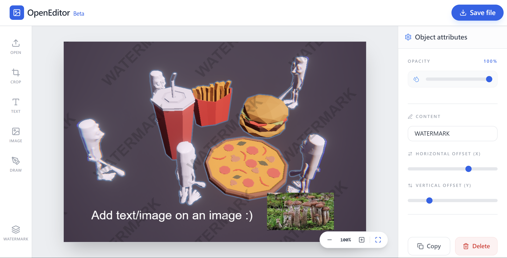

  

  🐲 OpenEditor is an open-source pdf/png/jpg editor.

## Features
- Runs completely locally
- Add Text
- Add Image
- Draw
- Crop
- One click watermark
- Format conversion

## Screenshot

## Note

> Build with Gemini, feel free to open a pull request